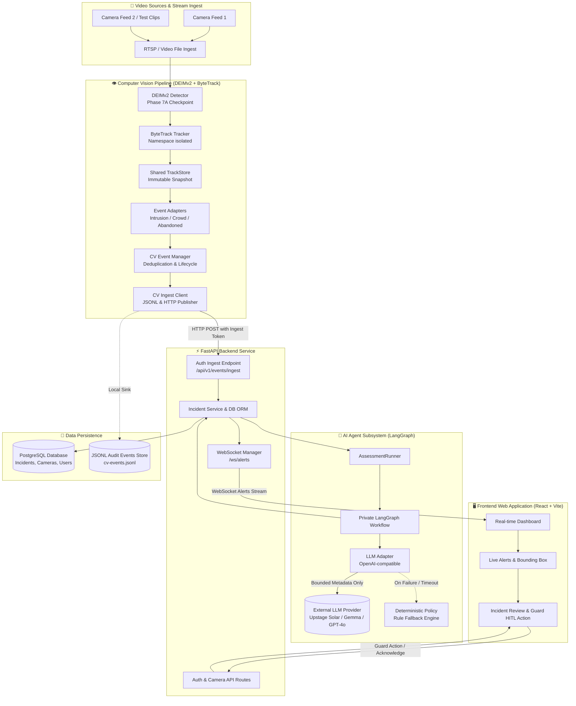
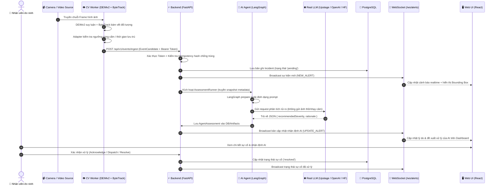
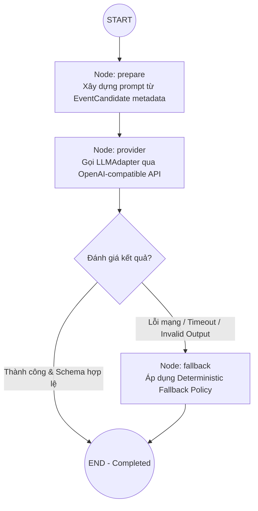

# Architecture Document — Smart Security Monitoring System MVP

**Project:** P-176 — Hệ Thống Giám Sát An Ninh Thông Minh (Smart Security Monitoring System)  
**Version:** 1.0.0 (Gate G2 — MVP)  
**Target:** AI-powered Real-time Computer Vision Surveillance & Advisory Incident Assessment  

---

## 1. System Overview

Hệ thống **Smart Security Monitoring System** là giải pháp giám sát an ninh camera thời gian thực kết hợp AI đa tầng:
- **Tầng Computer Vision (CV):** Sử dụng mô hình **DEIMv2** (Phase 7A) kết hợp tracking đối tượng **ByteTrack** để phát hiện liên tục các hành vi bất thường như xâm nhập vùng cấm (`ZONE_INTRUSION`), tụ tập đông người (`CROWD_THRESHOLD`), và phát hiện vật thể bỏ quên (`ABANDONED_OBJECT`).
- **Tầng AI Agent (LangGraph + Real LLM):** Điều phối đánh giá sự cố tự động (`AssessmentRunner`) thông qua LangGraph workflow với LLM thực tế (OpenAI-compatible / HuggingFace Router), trích xuất metadata không định danh để đưa ra nhận định chuyên môn (`rationale`), đề xuất mức độ nghiêm trọng (`recommendedSeverity`) và hành động ứng phó.
- **Tầng Backend & Realtime Gateway:** FastAPI REST API xử lý ingest có xác thực (`EVENT_INGEST_TOKEN`), quản lý cơ sở dữ liệu PostgreSQL và broadcast cảnh báo thời gian thực qua WebSockets (`/ws/alerts`).
- **Tầng Frontend (HITL Web UI):** Giao diện React + TypeScript hỗ trợ nhân viên an ninh (Guard / Security Manager) quan sát luồng camera, nhận diện bounding box, tiếp nhận khuyến nghị từ AI và đưa ra quyết định can thiệp kịp thời (Human-In-The-Loop).

---

## 2. System Architecture Diagram

---

## 3. Core Data Flow & Sequence Diagram

Quy trình dữ liệu từ lúc phát hiện đối tượng đến khi cảnh báo xuất hiện trên màn hình giám sát:

---

## 4. AI Agent Workflow Diagram (LangGraph)

Agent đánh giá sự cố được đóng gói hoàn toàn trong [`app/agents/_workflow.py`](file:///D:/Coding/P-176/app/agents/_workflow.py) và biên dịch một lần duy nhất per runtime instance:

- **Nguyên tắc bảo vệ quyền riêng tư (PRD §12.1):** AI Agent tuyệt đối không nhận hình ảnh thô hoặc dữ liệu nhận dạng cá nhân; chỉ nhận các trường metadata đo lường (vị trí camera, vùng ROI, số lượng người, thời gian lưu trú, bounding box toạ độ số).
- **Nguyên tắc cố vấn (Advisory Only):** Nhận định của Agent mang tính tham vấn, không tự động kích hoạt các hành động nguy hiểm mà luôn yêu cầu xác nhận từ con người (HITL).

---

## 5. System Components Breakdown

### 5.1 Computer Vision Subsystem (`app/cv/`)
- **Mô hình cốt lõi:** DEIMv2 (DEtection and IMproved contrastive pre-training v2) đạt mAP cao trong điều kiện camera giám sát thực tế.
- **Tracking:** ByteTrack đa đối tượng độc lập, phân tách namespace định danh rõ ràng giữa các lớp đối tượng (`person`, `luggage`).
- **Event Adapters:**
  - `IntrusionAdapter`: Giám sát xâm nhập vùng cấm ROI.
  - `CrowdAdapter`: Phát hiện tập trung quá số lượng người cho phép.
  - `AbandonedObjectAdapter`: Phát hiện hành lý/vật thể tĩnh bị chủ nhân rời xa quá thời gian quy định.

### 5.2 Backend API & Real-time Layer (`back-end/app/`)
- **FastAPI:** Cung cấp API RESTful phi đồng bộ tốc độ cao, hỗ trợ tài liệu tự động Swagger UI (`/docs`).
- **Ingest API:** Bảo vệ bằng mã bí mật `EVENT_INGEST_TOKEN` (HMAC comparison) và deduplication hash (SHA-256) tránh bão cảnh báo (alert storm).
- **WebSocket Manager:** Duy trì kết nối hai chiều với frontend, phát thông báo đẩy tức thời cho đội ngũ trực ban.

### 5.3 AI Agent Subsystem (`app/agents/`, `app/llm/`)
- **AssessmentRunner:** Thực thi pipeline đánh giá độ nguy hiểm, kiểm soát timeout và ghi log telemetry chi tiết (`latencyMs`, `model_name`, `fallbackUsed`).
- **LLM Adapter:** Tương thích linh hoạt với nhiều nhà cung cấp mô hình (Upstage Solar, Google Gemma, OpenAI GPT-4o, Groq, local vLLM).

### 5.4 Database & Storage Layer
- **PostgreSQL 15:** Lưu trữ quan hệ thực thể người dùng, cấu hình camera, phân vùng giám sát và toàn bộ lịch sử các sự cố (`incidents`, `incident_assessments`, `cameras`, `users`).
- **JSONL Event Store:** Lưu trữ audit trail bất biến của các sự kiện phát hiện từ CV (`artifacts/events/cv-events.jsonl`).

### 5.5 Frontend Dashboard (`front-end/src/`)
- **React 18 + TypeScript + Tailwind CSS:** Giao diện trực quan, tối ưu cho phòng điều hành an ninh.
- **Live Monitoring:** Hiển thị video camera stream song song với overlay bounding box thời gian thực.
- **Incident Management:** Bộ lọc sự cố theo mức độ nghiêm trọng, thời gian, camera và trạng thái xử lý.

---

## 6. Security & Failure Isolation

1. **Xác thực nhiều lớp:**
   - Người dùng đăng nhập xác thực bằng JWT Token (Bcrypt password hashing).
   - Thiết bị/CV Worker gửi sự kiện xác thực bằng Bearer token (`EVENT_INGEST_TOKEN`).
2. **Cô lập sự cố (Fault Tolerance):**
   - Sự cố ở 1 camera không ảnh hưởng đến các camera còn lại.
   - LLM service bị gián đoạn hoặc timeout $\rightarrow$ hệ thống tự động chuyển sang `deterministic-fallback` với mức cảnh báo an toàn mà không làm treo backend hay mất sự cố.
   - Kết nối WebSocket của một client bị ngắt không ảnh hưởng đến việc lưu trữ cơ sở dữ liệu.

---

## 7. Architecture Decision Records (ADRs)

| Quyết định | Giải pháp lựa chọn | Lý do & Đánh đổi |
|---|---|---|
| **CV Detector** | DEIMv2 (Phase 7A) | Tối ưu độ chính xác và khả năng nhận diện người/vật thể nhỏ so với YOLO truyền thống. |
| **Agent Framework** | LangGraph (Private Workflow) | Quản lý state chuẩn xác, kiểm soát luồng chuyển hướng fallback chặt chẽ, biên dịch gọn nhẹ. |
| **Realtime Channel** | WebSockets | Độ trễ mili-giây, giảm tải polling liên tục lên database. |
| **LLM Privacy Boundary** | Metadata-Only Transmission | Không gửi video/frame thô lên LLM bên ngoài, bảo vệ 100% quyền riêng tư và tiết kiệm băng thông. |
| **HITL Principle** | Mandatory Human Action | AI Agent chỉ đóng vai trò phân tích & khuyến nghị; con người giữ quyền quyết định cuối cùng. |
