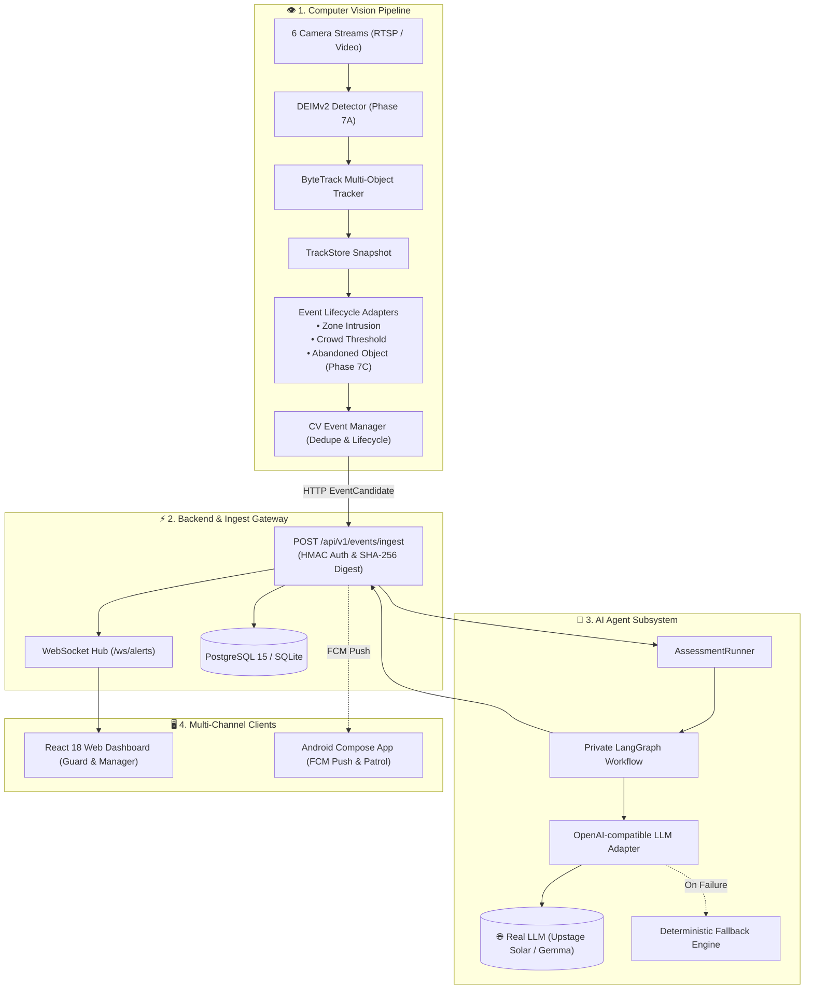

# Smart Security Monitoring System (Hệ Thống Giám Sát An Ninh Thông Minh)

[](#)
[](#)
[](#)
[](#)
[](#)
[](#)
[](#)
[](#)

> **Dự án:** P-176 — Hệ Thống Giám Sát An Ninh Thông Minh Đa Kênh (Smart Security Monitoring System)  
> **Mục tiêu Gate G2:** Vận hành luồng xử lý end-to-end hoàn chỉnh với mô hình Computer Vision và AI Agent LLM thực tế (không mock), kết nối đa kênh (Web Dashboard + Android Patrol App) với cơ chế kiểm soát con người (Human-in-the-loop).

---

## 🌟 1. Tổng Quan Kiến Trúc & Tính Năng Cốt Lõi

Hệ thống P-176 cung cấp giải pháp giám sát an ninh toàn diện gồm 4 phân hệ cốt lõi:



### Các Tính Năng Trọng Yếu:
1. **Phát Hiện Sự Cố Thời Gian Thực (Computer Vision):**
   - **Xâm nhập vùng cấm (`ZONE_INTRUSION`):** Giám sát đa giác ROI (Cổng chính, Hàng rào Tây, Phòng server), đo thời gian lưu trú (dwell time).
   - **Tụ tập đông người (`CROWD_THRESHOLD`):** Đếm số lượng người vượt ngưỡng an toàn trong khu vực sảnh / hành lang.
   - **Vật thể bỏ quên (`ABANDONED_OBJECT` - Phase 7C):** Nhận diện hành lý đứng yên, liên kết chủ nhân và phát hiện hành vi chủ nhân rời xa quá thời gian quy định.
2. **AI Agent Phân Tích & Cố Vấn (LangGraph + Real LLM):**
   - Đồ thị suy luận StateGraph riêng biệt, biên dịch một lần (Single Compilation Root).
   - Đánh giá mức độ nghiêm trọng (`recommendedSeverity`: `INFO`, `WARNING`, `HIGH`, `CRITICAL`), trích xuất lý giải nghiệp vụ (`rationale`) và khuyến nghị hành động.
   - **Ranh giới bảo mật PRD §12.1:** Tuyệt đối không truyền frame ảnh thô hay khuôn mặt ra bên ngoài; chỉ truyền metadata số học phi định danh.
   - **Chịu lỗi tự động:** Tự động kích hoạt `deterministic-fallback` nếu LLM timeout hoặc mất kết nối.
3. **Phòng Điều Hành Trực Ban (React Web UI):**
   - Lưới hiển thị 6 camera, lớp phủ Bounding Box theo thời gian thực.
   - Đẩy thông báo tức thời qua WebSockets (`/ws/alerts`).
   - Phân quyền theo vai trò (RBAC): Bảo vệ (`GUARD`) trực ban xử lý cảnh báo; Quản lý (`MANAGER`) xem bản đồ điểm nóng (`/heatmap`) và nhật ký kiểm toán (`/audit`).
4. **Kênh Cảnh Báo Di Động (Android Kotlin + Jetpack Compose):**
   - Ứng dụng Android độc lập (`mobile/`) hỗ trợ bảo vệ tuần tra tiếp nhận cảnh báo khẩn cấp và báo cáo hiện trường.

---

## 🛠️ 2. Công Nghệ Sử Dụng (Tech Stack)

| Phân hệ | Công nghệ & Thư viện | Mô tả |
|---|---|---|
| **Computer Vision** | DEIMv2 (Phase 7A Checkpoint), ByteTrack, OpenCV, PyTorch | Detector thời gian thực, bám vết đối tượng phân tách namespace `person` / `luggage`. |
| **AI Agent** | LangGraph, LangChain Core, OpenAI API | Điều phối suy luận phân tích rủi ro, kết nối `upstage/solar-pro4` hoặc `google/gemma-3-4b-it`. |
| **Back-End API** | Python 3.11+, FastAPI, Uvicorn, SQLAlchemy 2.0, Pydantic v2 | REST API, WebSocket Manager, HMAC Ingest Auth, JWT Security. |
| **Front-End Web** | React 18, TypeScript, Vite, Tailwind CSS, Lucide Icons | Dashboard phòng điều hành, WebSocket live stream, Bounding box rendering. |
| **Mobile App** | Kotlin, Jetpack Compose, Coroutines, Flow | App tuần tra Android 8.0+ (API 26+), Firebase Cloud Messaging (FCM). |
| **Cơ sở dữ liệu** | PostgreSQL 15 (Alpine) & SQLite fallback | Lưu trữ thực thể Camera, Zone, User, Incident, AssessmentJob, AuditLog. |
| **DevOps & Testing** | Docker, Docker Compose, Pytest, Vitest | 308 automated tests, Vitest component smoke tests, Multi-stage Docker build. |

---

## 📁 3. Cấu Trúc Thư Mục Dự Án (Project Structure)

```text
.
├── app/                        # 🧠 Lõi AI Agent & Computer Vision Engine
│   ├── agents/                 # LangGraph Workflow (_workflow.py), AssessmentRunner, Policy, Records
│   ├── cv/                     # DEIMv2 Detector, ByteTrack Tracker, Event Adapters (Intrusion/Crowd/Phase7C)
│   ├── llm/                    # OpenAI-compatible LLM Adapter kết nối mô hình thực tế
│   ├── common/                 # Pydantic Schemas & Contracts (EventCandidate, AgentAssessment)
│   └── config.py               # Quản lý cấu hình tập trung (AppConfig)
├── back-end/                   # ⚡ FastAPI Backend Service
│   ├── app/
│   │   ├── api/                # Endpoints: auth, alerts, cameras, zones, events_ingest
│   │   ├── db/                 # SQLAlchemy Models (User, Camera, Incident, AssessmentJob, AuditLog)
│   │   ├── services/           # Ingest Service, WebSocket Manager, Assessment Worker, Simulator
│   │   └── main.py             # FastAPI App Root & WebSocket Router
│   ├── Dockerfile              # Dockerfile backend
│   └── pyproject.toml          # Dependencies backend
├── front-end/                  # 🖥️ React TypeScript Frontend
│   ├── src/
│   │   ├── pages/              # DashboardPage, IncidentsPage, IncidentDetailPage, HeatmapPage, AuditPage, LoginPage
│   │   ├── components/         # CameraGrid, AlertCard, NotificationToast, BoundingBoxOverlay
│   │   ├── realtime/           # WebSocket EventsProvider & Event Listeners
│   │   ├── auth/               # AuthContext & ProtectedRoute (RBAC)
│   │   └── api/                # API Client & Transport Adapters
│   ├── Dockerfile              # Multi-stage Dockerfile (Vite Build -> Nginx)
│   └── package.json            # Dependencies frontend
├── mobile/                     # 📱 Ứng dụng Android tuần tra (Kotlin + Jetpack Compose)
│   ├── app/                    # Mã nguồn Android App, ActionPolicy, ViewModels, UI Screens
│   ├── tools/                  # Script kiểm thử FCM push notification (send_fcm.py)
│   └── README.md               # Hướng dẫn build và chạy Android App
├── configs/                    # ⚙️ Cấu hình hệ thống (YAML)
│   ├── cameras.yaml            # Danh sách 6 camera giám sát và nguồn stream
│   ├── zones.yaml              # Tọa độ đa giác vùng cấm (ROI Polygons)
│   ├── event_rules.yaml        # Ngưỡng thời gian lưu trú, crowd count, stationary hold
│   └── models.yaml             # Đường dẫn checkpoint DEIMv2 và DINOv3 backbone
├── devtools/                   # 🛠️ Công cụ nhà phát triển (Webcam CV Test App)
├── eval/results/               # 📊 Báo cáo đánh giá Gate G2 & 5 Test Cases thực tế
├── presentation/               # 🎬 Video Demo 3 phút (mp4) & Kịch bản thuyết trình
├── scripts/                    # 📜 Scripts vận hành: run_mvp.ps1, demo_cli, submit_log
├── tests/                      # 🧪 Bộ 308 automated tests (unit, contracts, integration, agents, api)
├── ARCHITECTURE.md             # 🏛️ Tài liệu kiến trúc toàn diện và sơ đồ Mermaid
├── docker-compose.yml          # Container orchestration (PostgreSQL + Backend + Frontend)
├── .env.example                # File mẫu biến môi trường
└── README.md                   # Tài liệu hướng dẫn dự án
```

---

## 🚀 4. Hướng Dẫn Khởi Chạy Dự Án (Getting Started)

### Cách 1: Khởi Chạy Nhanh Bằng PowerShell Script (Khuyến nghị trên Windows)

```powershell
# 1. Tạo file cấu hình môi trường
copy .env.example .env

# 2. Khởi chạy toàn bộ hệ thống (Backend API + Frontend Web UI)
.\scripts\run_mvp.ps1
```
*Script tự động kiểm tra polling `/health`, khởi động Backend tại `http://localhost:8000` và Frontend tại `http://localhost:5173`.*

---

### Cách 2: Khởi Chạy Bằng Docker Compose (Windows & Linux)

Yêu cầu: Đã cài đặt **Docker Desktop** (Windows) hoặc **Docker Engine** (Linux).

```bash
# 1. Chuẩn bị file môi trường
cp .env.example .env

# 2. Build và khởi chạy toàn bộ 3 container (PostgreSQL + Backend + Frontend)
docker compose up --build -d

# 3. Xem trạng thái các container
docker compose ps

# 4. Xem log thời gian thực
docker compose logs -f

# 5. Dừng hệ thống
docker compose down
```

---

## 🌐 5. Địa Chỉ Truy Cập (Access URLs) & Tài Khoản Mẫu

| Dịch vụ | Địa chỉ / URL | Mô tả |
|---|---|---|
| **Front-End (Web Dashboard)** | [http://localhost:5173](http://localhost:5173) | Giao diện phòng trực ban giám sát an ninh (React) |
| **Back-End REST API** | [http://localhost:8000](http://localhost:8000) | FastAPI Server |
| **Swagger API Docs** | [http://localhost:8000/docs](http://localhost:8000/docs) | Tài liệu API tương tác tự động |
| **ReDoc API Docs** | [http://localhost:8000/redoc](http://localhost:8000/redoc) | Giao diện tài liệu ReDoc |
| **PostgreSQL Database** | `localhost:5432` | DB: `security_db` \| User: `postgres` \| Pass: `postgres` |

### 🔑 Tài khoản đăng nhập:
- **Tài khoản Bảo vệ (Guard):** `guard` / `guard123` (Trực ca 6 camera, xem cảnh báo realtime, xác nhận xử lý sự cố).
- **Tài khoản Quản lý (Manager):** `manager` / `manager123` (Toàn quyền, xem thêm Bản đồ điểm nóng `/heatmap` và Nhật ký kiểm toán `/audit`).

---

## 🧪 6. Chạy Demo & Kiểm Thử Sự Cố

### 1. Chạy Demo CLI Kiểm Thử Luồng End-to-End
Kích hoạt pipeline DEIMv2 phân tích clip video mẫu, gửi `EventCandidate` qua API và kiểm tra phản hồi realtime trên WebSocket:

```powershell
$env:EVENT_INGEST_TOKEN = 'secret-security-token-2026'
python -m app.cv.demo_cli
```

### 2. Chạy Luồng Giám Sát Multi-Camera (CV Stream)
```powershell
python -m app.cv.multi_camera_runner
```

### 3. Kiểm Thử Với Webcam Trực Tiếp (DevTools)
```powershell
third_party\deimv2\.python311\python.exe devtools\webcam_cv_test\app.py
```

### 4. Video Demo 3 Phút & Kịch Bản Thuyết Trình
- File video demo chính thức: [`presentation/mvp-demo-2026-08-16.mp4`](file:///D:/Coding/P-176/presentation/mvp-demo-2026-08-16.mp4).
- Kịch bản timeline 4 phân cảnh và cấu trúc slide: [`presentation/README.md`](file:///D:/Coding/P-176/presentation/README.md).

---

## 📝 7. Ví Dụ Gọi API (Sample Queries)

### 1. Đăng nhập lấy Token xác thực (JWT)
```bash
curl -X POST http://localhost:8000/api/v1/auth/login \
  -H "Content-Type: application/json" \
  -d '{"username":"guard","password":"guard123"}'
```

### 2. Lấy danh sách sự cố cảnh báo (Hỗ trợ lọc)
```bash
curl -X GET "http://localhost:8000/api/v1/alerts" \
  -H "Authorization: Bearer <YOUR_JWT_TOKEN>"
```

### 3. Bảo vệ xác nhận xử lý sự cố (Acknowledge Action)
```bash
curl -X POST "http://localhost:8000/api/v1/alerts/1/acknowledge" \
  -H "Authorization: Bearer <YOUR_JWT_TOKEN>"
```

### 4. Lắng nghe cảnh báo thời gian thực qua WebSocket
```javascript
const socket = new WebSocket("ws://localhost:8000/ws/alerts");
socket.onmessage = (event) => {
  const data = JSON.parse(event.data);
  console.log("Cảnh báo mới từ hệ thống:", data);
};
```

---

## 📊 8. Kết Quả Đánh Giá Nghiệm Thu (Evaluation & Metrics)

Báo cáo nghiệm thu kỹ thuật chi tiết tại [`eval/results/report.md`](file:///D:/Coding/P-176/eval/results/report.md):
- **Độ chính xác đánh giá AI (Reasoning Accuracy):** $100\%$ trên bộ test cases chuẩn.
- **Độ trễ trung bình gọi LLM thực tế:** $2.5\text{s} - 2.9\text{s}$ (đo bằng telemetry).
- **Khả năng chống trùng lặp (Duplicate Suppression):** $100\%$ qua cơ chế SHA-256 payload digest.
- **Bộ Test Suite tự động:** **308 tests** vượt qua toàn bộ kiểm thử đơn vị, hợp đồng và tích hợp.
- **Kiểm thử hồi quy Video thật (CV Regression):** $4/4$ clips đạt chuẩn (ABODA vật thể bỏ quên, Walk1 xâm nhập, Meet_Crowd tụ tập, Browse1 âm tính).

---

## 🏛️ 9. Tài Liệu Tham Khảo (Documentation)

- Sơ đồ kiến trúc & Data Flow toàn diện: [`ARCHITECTURE.md`](file:///D:/Coding/P-176/ARCHITECTURE.md)
- Chi tiết sơ đồ State Machine AI Agent: [`docs/architecture_diagram.md`](file:///D:/Coding/P-176/docs/architecture_diagram.md)
- Báo cáo nghiệm thu Gate G2: [`eval/results/report.md`](file:///D:/Coding/P-176/eval/results/report.md)
- Kịch bản thuyết trình & Slide Deck: [`presentation/README.md`](file:///D:/Coding/P-176/presentation/README.md)
- Tài liệu ứng dụng Android tuần tra: [`mobile/README.md`](file:///D:/Coding/P-176/mobile/README.md)
