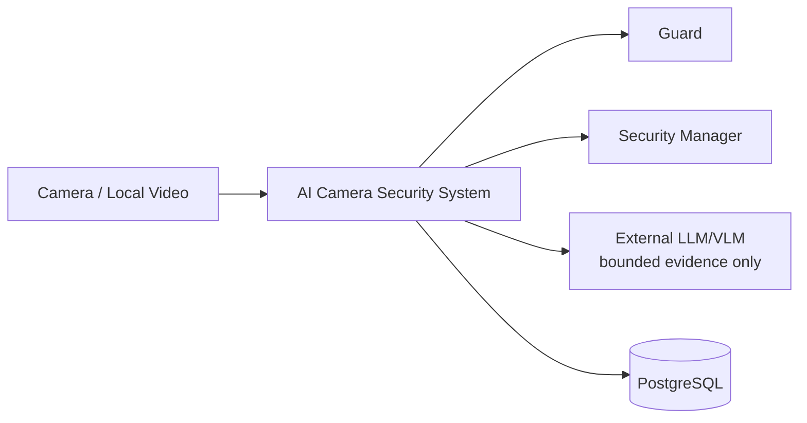
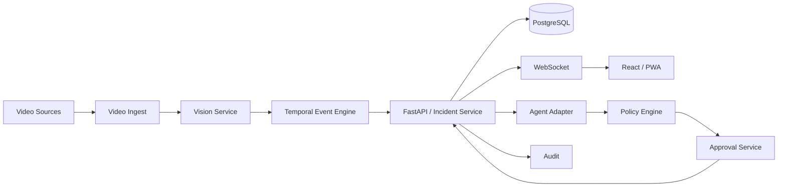
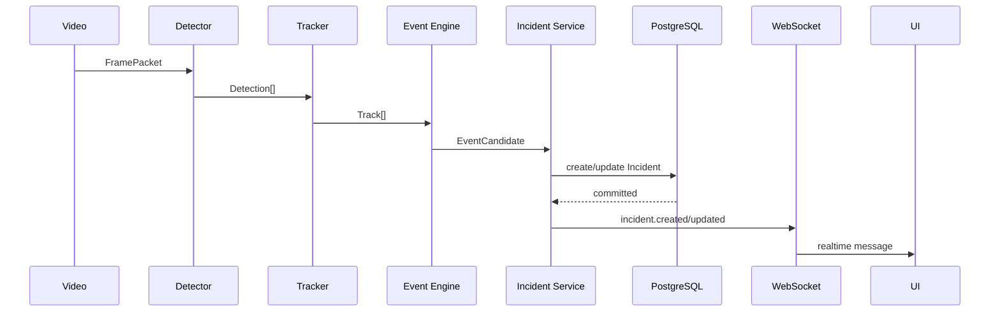
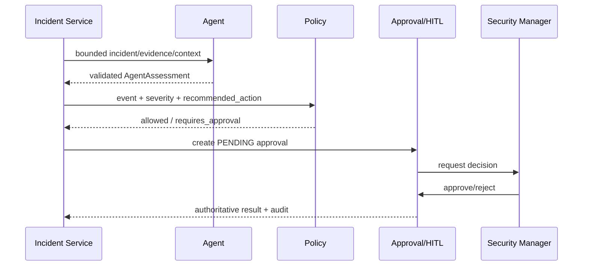
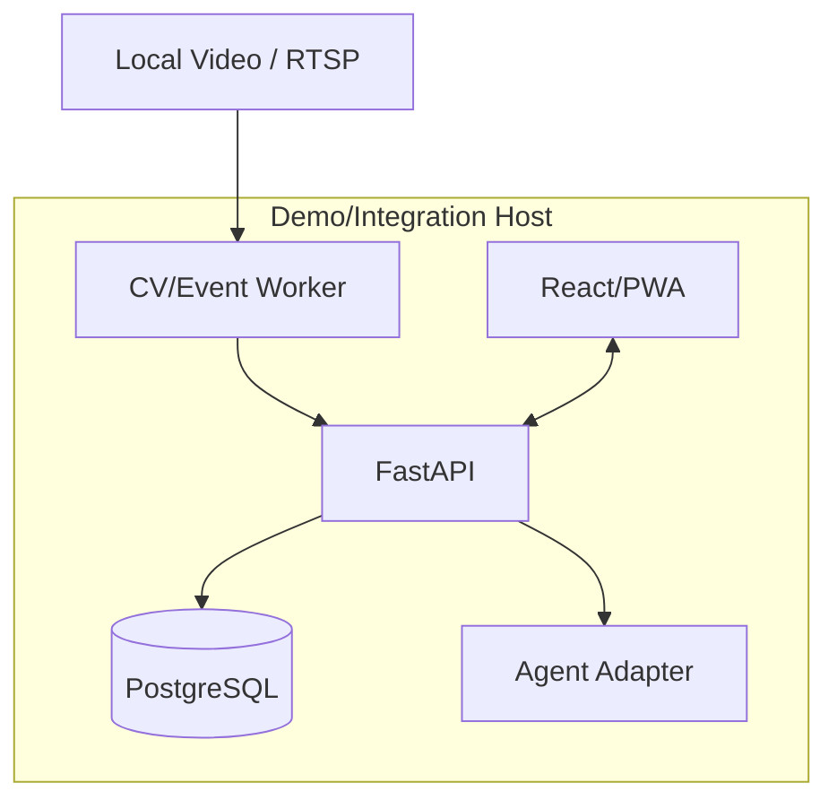

# ARCHITECTURE — Kiến trúc hệ thống AI Camera Security Agent

**Phiên bản:** v1  
**Trạng thái:** Kiến trúc mục tiêu cho MVP; chưa phải xác nhận rằng repository/runtime hiện đã triển khai đúng cấu trúc này.

---

## 1. Mục tiêu kiến trúc

- xử lý video gần realtime;
- tách rõ CV detection, temporal event, incident business state và Agent reasoning;
- đảm bảo HITL không bypass;
- giảm duplicate/alert storm;
- isolate failure theo camera/service;
- đo được latency/capacity;
- dễ triển khai trong 4 tuần với 4 vai trò;
- không over-engineer distributed infrastructure.

## 2. Bối cảnh hệ thống



External AI là optional/gated; không nhận continuous raw video.

## 3. Góc nhìn cấp container



MVP có thể triển khai các logical component trong ít process/container hơn. Boundary semantic quan trọng hơn số microservice.

## 4. Ranh giới module

### 4.1 Video Ingest

Owns:

- file/RTSP connection;
- decode;
- sampling;
- `FramePacket`;
- camera health.

Does not own:

- object detection;
- event semantics;
- incident persistence.

### 4.2 Vision

Owns:

- model loading;
- detection;
- tracker;
- inference timing.

Emits:

- `Detection[]`
- `Track[]`

Does not own:

- dwell/crowd duration;
- incident status;
- HITL.

### 4.3 Temporal Event Engine

Owns:

- ROI;
- temporal state;
- event rules;
- debounce/cooldown;
- event dedupe;
- `EventCandidate`.

Đây là primary event detector cho MVP.

### 4.4 Incident/API

Owns:

- schema validation;
- durable `Incident`;
- idempotent upsert;
- REST;
- WebSocket publish after persist;
- auth/RBAC integration;
- evidence metadata.

### 4.5 Agent

Owns:

- bounded incident assessment;
- structured output;
- model/prompt/version trace.

Does not own:

- event existence;
- authorization;
- protected action execution.

### 4.6 Policy/HITL

Owns:

- deterministic policy;
- protected action classification;
- `Approval` lifecycle;
- role enforcement;
- audit.

### 4.7 UI

Owns:

- presentation;
- local interaction state;
- reconnect/reconcile UX.

Does not own authoritative incident/approval transition.

## 5. Cấu trúc repository đề xuất

Đây là cấu trúc **đề xuất**, chưa phải cấu trúc repo đã tồn tại:

```text
.
├── apps/
│   ├── api/
│   └── dashboard/
├── services/
│   ├── video_ingest/
│   ├── vision/
│   ├── event_engine/
│   └── agent/
├── packages/
│   ├── contracts/
│   ├── config/
│   └── observability/
├── tests/
├── docs/
├── infra/
├── README.md
├── BRIEF.md
├── BRD.md
├── PRD.md
├── SPEC.md
├── UI_WIREFRAME.md
└── ARCHITECTURE.md
```

Nếu repository khi được cung cấp có conventions khác, follow existing patterns và update tài liệu.

## 6. Luồng dữ liệu

### 6.1 Core event path



### 6.2 Agent/HITL path



Policy vẫn được áp dụng nếu Agent nói approval không cần thiết.

## 7. Cô lập lỗi

### Camera source

Mỗi camera/source có worker/state riêng hoặc tương đương. Failure một source không crash toàn pipeline.

### Detector/tracker

Model failure phải surface rõ; không generate fabricated event.

### Event engine

State per camera/event key. Restart behavior phải test để biết duplicate risk.

### Database

DB unavailable => readiness false; không send fake realtime success.

### WebSocket

Slow/disconnected client không block persistence.

### Agent

Timeout/invalid schema => fallback; incident không mất.

### Approval

Concurrent decision => server-side idempotency/transaction.

## 8. Mô hình lưu trữ

PostgreSQL là authoritative persistence cho business state.

Logical entities:

```text
Camera
Zone
Incident
IncidentEvidence
Approval
User
Role
AuditLog
```

Event history có thể lưu snapshot/history tùy implementation; exact model chưa chốt.

## 9. Kiến trúc evidence

Evidence nên tách metadata và binary media.

```text
Incident -> IncidentEvidence -> storage_ref
```

Rules:

- `storage_ref` internal/protected;
- API authorize access;
- retention cleanup coordinated với metadata;
- no raw bytes in normal logs.

Storage backend chưa chốt.

## 10. Kiến trúc context cho Agent

Ưu tiên structured bounded context:

- camera metadata;
- zone metadata;
- recent incident summaries;
- operating schedule nếu configured;
- prior operator resolution summary nếu an toàn.

Vector DB chỉ thêm nếu có evidence rằng structured context không đủ cho MVP.

## 11. Kiến trúc bảo mật

### Ranh giới tin cậy

```text
Browser
  |
  | authenticated API/WS
  v
Backend ------------------ External AI
  |                         ^
  | protected evidence      | bounded payload only
  v                         |
Storage/DB -----------------
```

### Kiểm soát

- auth/RBAC server-side;
- secrets server-side;
- evidence protected;
- audit protected decisions;
- minimum necessary Agent payload;
- no continuous raw stream to external AI.

## 12. Kiến trúc cấu hình

Typed/validated config layer.

Categories:

- runtime;
- camera;
- CV;
- tracker;
- event rules;
- storage;
- security;
- Agent;
- frontend public endpoints.

Secret và non-secret config cần tách về behavior/logging.

## 13. Kiến trúc quan sát hệ thống

### Log
Structured, correlation-aware.

### Metric
- source FPS;
- detector latency;
- event counts;
- incident create/update;
- duplicate counters;
- WS disconnect;
- Agent latency/failure;
- approval results;
- load resources.

### Tracing
Full distributed tracing không bắt buộc. Correlation IDs + stage timestamps đủ cho MVP nếu reproducible.

## 14. Mô hình triển khai

Recommended MVP:



GPU optional tùy hardware.

Kubernetes/Kafka không required.

## 15. Chiến lược mở rộng

MVP không claim hundreds-camera support.

Test scale:

- 1 source;
- 2 sources;
- 4 sources.

Nếu cần scale sau MVP, các boundary hiện tại cho phép:

- separate ingest/vision workers;
- queue/event bus;
- GPU worker pool;
- horizontal API;
- object storage.

Không thêm trước khi cần.

## 16. Chiến lược phục hồi/chịu lỗi

- reconnect with backoff;
- health state;
- persistence-first;
- REST reconciliation;
- idempotency keys;
- safe Agent fallback;
- transaction/unique constraints;
- bounded retry.

## 17. Các quyết định kiến trúc đã khóa

- Web/PWA thay native mobile MVP.
- 3 event MVP.
- deterministic temporal event engine.
- local video Week 1.
- persist-before-notify.
- versioned shared contracts.
- protected action via policy + HITL.
- no continuous raw video to external AI.
- abandoned object không owner recognition.
- Agent enablement after baseline.
- event-level evaluation.
- no unsupported scale claim.

## 18. Các quyết định kiến trúc còn mở

- model checkpoint;
- tracker choice;
- ROI membership method;
- numeric event thresholds;
- evidence storage backend;
- auth mechanism;
- Agent provider/model;
- approval expiry;
- event-state recovery after restart;
- official demo hardware.

Mỗi quyết định nên có reason + evidence + consequence khi được chốt.
