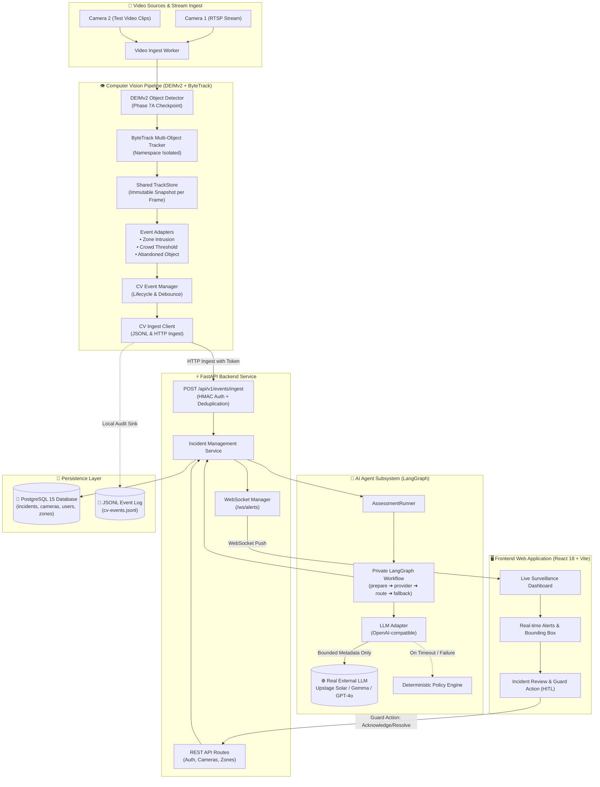
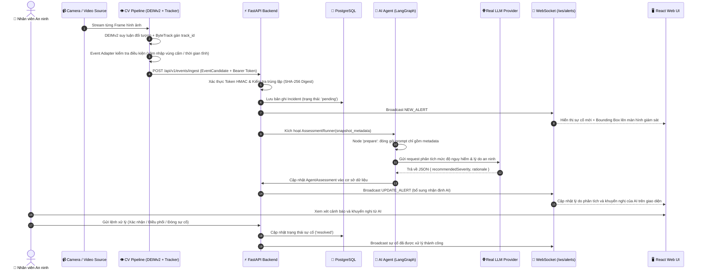
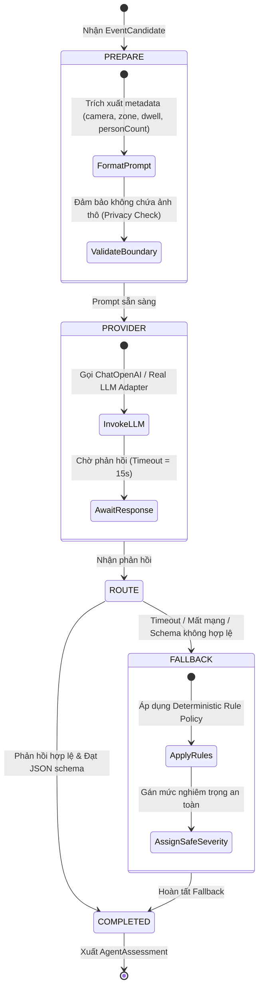

# Architecture Diagram — Smart Security Monitoring System

**Project:** P-176 — Hệ Thống Giám Sát An Ninh Thông Minh  
**Milestone:** Gate G2 — MVP  

---

## 1. System Architecture & Components Overview

Sơ đồ tổng quan toàn bộ các thành phần (Components) trong hệ thống:

---

## 2. End-to-End Data Flow Sequence

Sơ đồ tuần tự luồng dữ liệu xử lý xuyên suốt từ khung hình video đến giao diện nhân viên an ninh:

---

## 3. AI Agent Workflow Diagram (LangGraph)

Agent đánh giá rủi ro an ninh hoạt động theo State Machine có kiểm soát fallback chặt chẽ:

---

## 4. Chi Tiết Thành Phần Hệ Thống (Component Specifications)

| Thành phần (Component) | Công nghệ / Thư viện | Trách nhiệm chính (Responsibility) | Giao tiếp (Interfaces) |
|---|---|---|---|
| **Video Ingest & CV** | DEIMv2, ByteTrack, OpenCV | Đọc luồng video, phát hiện người/vật thể, bám vết đối tượng, phát hiện sự cố theo quy tắc thời gian thực. | Output: `EventCandidate` qua HTTP POST / JSONL |
| **Backend API Gateway** | FastAPI, Pydantic v2, Uvicorn | Tiếp nhận sự kiện có xác thực, chống bão cảnh báo (idempotency), quản lý tài khoản và camera. | Ingest: `/api/v1/events/ingest` REST: `/api/v1/...` |
| **Realtime Engine** | WebSocket (FastAPI Starlette) | Đẩy tức thời sự cố mới và cập nhật nhận định AI đến tất cả các phiên làm việc của bảo vệ. | `/ws/alerts` |
| **AI Agent Orchestrator** | LangGraph, LangChain Core | Quản lý vòng đời suy luận AI, chuẩn hóa cấu trúc prompt, kiểm soát timeout và fallback xác định. | `AssessmentRunner.assess()` |
| **LLM Reasoning Engine** | OpenAI-compatible API (`ChatOpenAI`) | Phân tích metadata sự cố bằng các mô hình LLM thực tế (`upstage/solar-pro4`, `google/gemma-3-4b-it`, `gpt-4o`). | HTTPS JSON Chat Completions |
| **Database Layer** | PostgreSQL 15, SQLAlchemy 2.0 | Lưu trữ bền vững dữ liệu sự cố, cấu hình camera, phân vùng giám sát và nhật ký hành động của bảo vệ. | Port `5432` / SQL Queries |
| **Web UI Dashboard** | React 18, Vite, Tailwind CSS, Lucide | Giao diện phòng trực ban: xem camera live, quan sát bounding box, tiếp nhận cảnh báo và xử lý HITL. | Port `5173` / HTTP REST + WS |

---

## 5. Các Ranh Giới An Toàn & Bảo Mật (Safety & Security Boundaries)

1. **Ranh giới Quyền Riêng Tư (Privacy Boundary):**
   - Không truyền hình ảnh khuôn mặt hoặc video thô lên các mô hình LLM bên ngoài.
   - Chỉ truyền các trường metadata phi định danh: toạ độ vùng, số lượng người, thời gian lưu trú, độ tin cậy của thuật toán CV.
2. **Ranh giới Ra Quyết Định (Human-in-the-Loop Boundary):**
   - AI Agent chỉ đóng vai trò **cố vấn (Advisory Only)**.
   - Không cho phép AI tự động thực hiện các hành động can thiệp vật lý (như khóa cửa, gọi cảnh sát) nếu chưa có sự xác nhận từ con người.
3. **Cơ Chế Chịu Lỗi (Fault-Tolerance):**
   - Nếu LLM không khả dụng hoặc phản hồi quá thời gian quy định, hệ thống tự động kích hoạt `deterministic-fallback` dựa trên luật cố định, đảm bảo mọi sự cố đều được ghi nhận và cảnh báo kịp thời.
